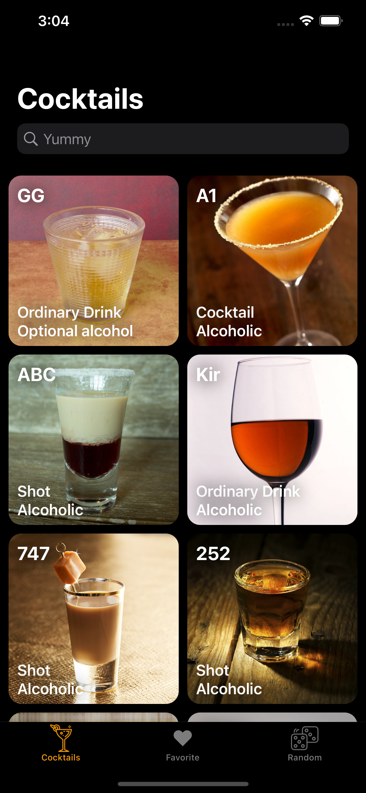
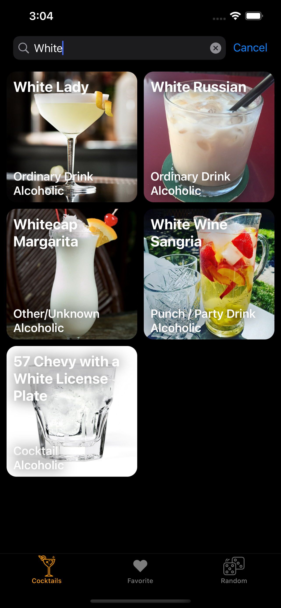
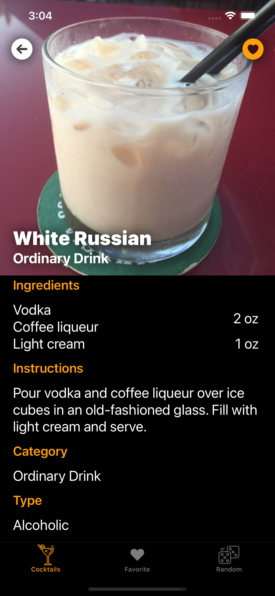
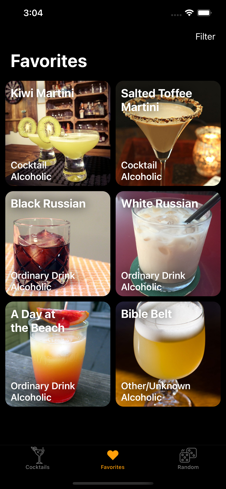
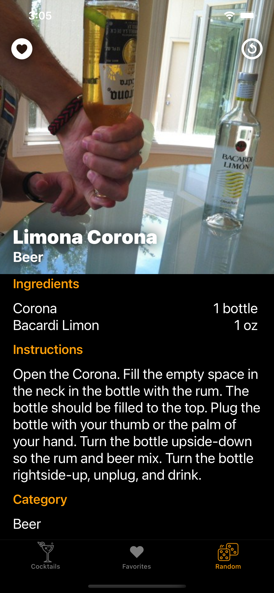

# The Best Party 

### Table of Contents
- [General Info](#general-info)
- [Technologies And Features](#technologies-and-features)
- [Third Party Libraries](#third-party-libraries)
- [Preview](#preview)
- [Screenshots](#screenshots)

### General Info
Such a simple and necessary party app 

### Technologies And Features
- UIKit
- Full programmatically (No Storyboards)
- MVP + Assembly Module Builder+ Router
- SOLID
- Unit Testing
- Builders
- Factory method

### Third Party Libraries
- Lottie  - version 3.3.0
- Realm  - version 10.22.0
- RealmDatabase  - version 11.9.0

### Preview

### Screenshots

